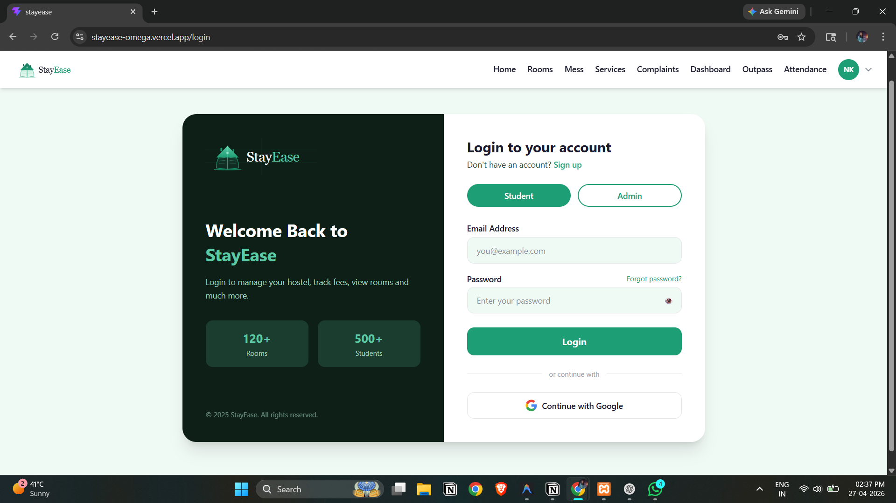
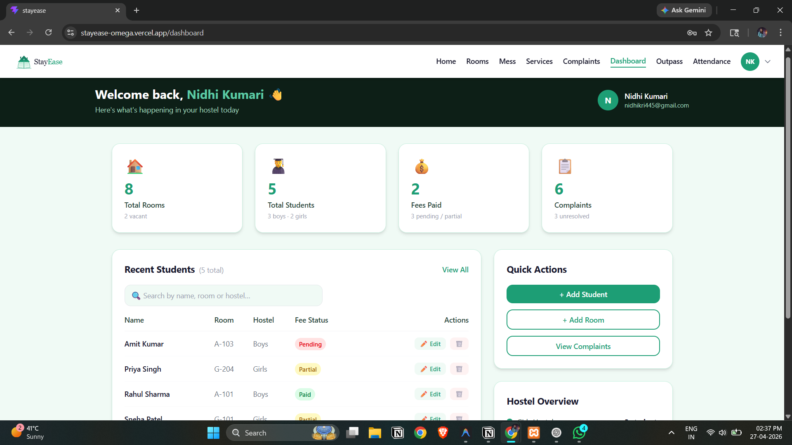
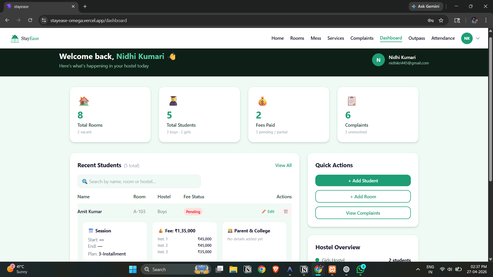

# StayEase – Hostel & Student Management Platform

A full-stack web application to manage hostel operations including student onboarding, room allocation, and fee tracking with secure authentication and real-time data handling.

---

## 🚀 Live Demo

👉 https://stayease-omega.vercel.app

---

## ✨ Features

* 🔐 User Authentication (JWT-based login & signup)
* 🔑 Google OAuth login integration
* 🏠 Room allocation and management
* 👨‍🎓 Student onboarding system
* 💰 Fee tracking system
* 📊 Dashboard for managing hostel data
* 🔒 Protected routes for secure access

---

## 🛠️ Tech Stack

**Frontend**

* React
* Tailwind CSS
* Axios

**Backend**

* Node.js
* Express.js

**Database**

* MySQL

**Authentication**

* JWT (JSON Web Tokens)
* Google OAuth (Passport.js)

**Deployment**

* Frontend: Vercel
* Backend & Database: Railway

---

## 📸 Screenshots

### 🔐 Login Page

### 📊 Dashboard

### 🏠 Rooms Page

---

## 🧪 Run Locally

### Clone the repository

git clone https://github.com/Nidhi782/stayease.git

### Install dependencies

cd backend
npm install

cd ../frontend
npm install

### Setup environment variables (backend)

Create `.env` file:

DB_HOST=localhost
DB_USER=root
DB_PASSWORD=
DB_NAME=stayease
JWT_SECRET=your_secret

### Run the project

Backend:
npm start

Frontend:
npm run dev

---

## 📚 What I Learned

* Building full-stack applications using React and Node.js
* Implementing secure authentication using JWT
* Integrating Google OAuth with Passport.js
* Handling real-world deployment issues
* Connecting MySQL database in production environment

---

## 👩‍💻 Author

Nidhi Kumari
B.Tech CSE
